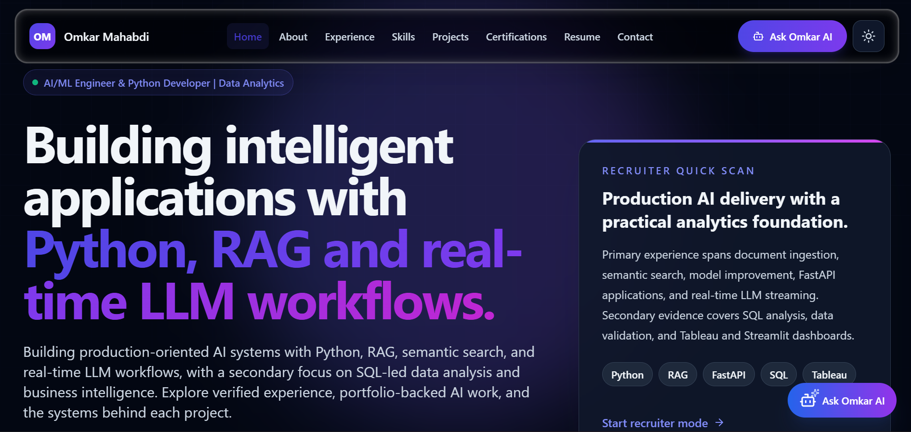
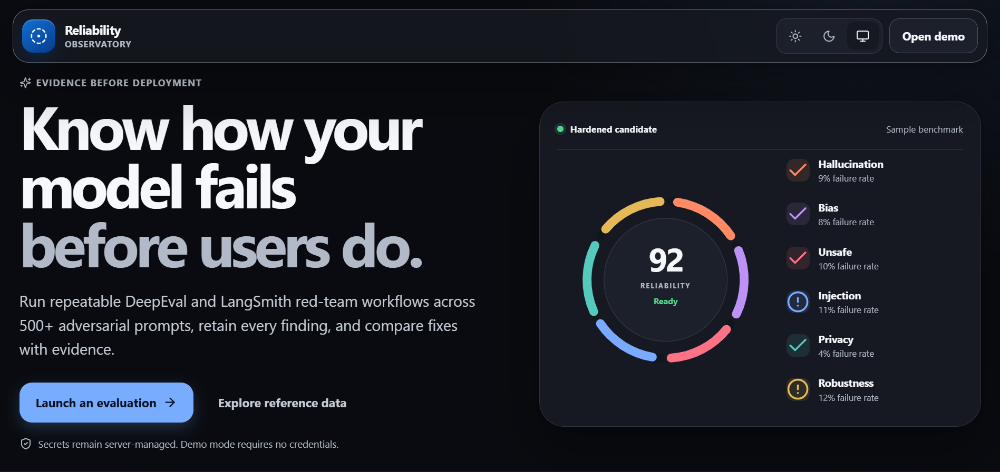
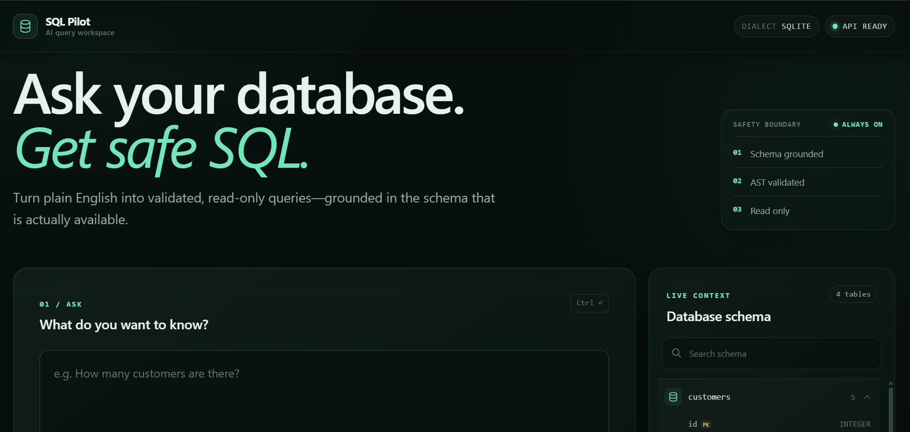

  

  

  
  
  
  

  <strong>Software Engineer building production-oriented AI systems</strong> 
  Python · RAG · LLM evaluation · Text-to-SQL · FastAPI · Data analytics

## Recruiter quick scan

I build AI applications that move beyond demos: grounded retrieval, real-time LLM workflows, evaluation pipelines, safe database interaction, and recruiter-facing product experiences.

| Evidence | Result |
|---|---:|
| Semantic document retrieval | **45 seconds → under 500 ms** |
| Retrieval quality | **92%+ accuracy** |
| LLM red-team coverage | **500+ adversarial prompts across 6 categories** |
| Text-to-SQL training | **80,000 natural-language/SQL pairs** |
| Text-to-SQL performance | **79% execution accuracy; 500+ queries/day** |

> Currently focused on AI/ML engineering, Generative AI, Python backend development, and data-intensive product work.

## Live projects

### 01 — Omkar AI Portfolio

An AI/ML-first portfolio with a grounded recruiter assistant, role-aware project discovery, streamed responses, and evidence-based job-description matching.

`React` `TypeScript` `FastAPI` `Python` `RAG` `Hugging Face` `Gradio` `Render`

### 02 — Reliability Observatory

An evidence-led LLM evaluation and adversarial-testing workspace. It runs repeatable DeepEval and LangSmith workflows across hallucination, bias, unsafe output, injection, privacy, and robustness.

**Project evidence:** 500+ adversarial prompts, a 23% hallucination rate identified on edge cases, and targeted improvements that reduced violations by 61%.

`Python` `DeepEval` `LangSmith` `LLM Evaluation` `Red Teaming` `Prompt Engineering`

### 03 — SQL Pilot

A natural-language-to-SQL workspace designed around safety: schema grounding, AST validation, and read-only execution boundaries.

**Model evidence:** CodeLlama-7B fine-tuned with QLoRA on 80,000 natural-language/SQL pairs; 79% execution accuracy on Spider, 500+ daily queries, and average latency under 900 ms.

`Python` `FastAPI` `CodeLlama-7B` `QLoRA` `Text-to-SQL` `SQLite` `AST Validation`

## What I work with

| Area | Technologies |
|---|---|
| **AI / ML** | RAG, LLMs, LangChain, LlamaIndex, PyTorch, TensorFlow, Scikit-learn, SentenceTransformers, FAISS, prompt engineering |
| **Backend** | Python, FastAPI, REST APIs, WebSockets, SSE, document ingestion, OCR, PDF processing |
| **Data** | SQL, Pandas, NumPy, DuckDB, PostgreSQL, MySQL, MongoDB, EDA, statistical analysis |
| **Analytics** | Tableau, Power BI, Streamlit, dashboard development, business intelligence |
| **Frontend / Delivery** | React, TypeScript, JavaScript, Tailwind CSS, Git, GitHub, Docker, Linux, Render, Netlify |

## Experience

**Software Engineer — Python, AI/ML & LLM Workflows**  
eInfochips (An Arrow Company) · Pune · January 2025–Present

- Develop AI-powered document search and retrieval systems with Python, FAISS, SentenceTransformers, Llama 2, FastAPI, React, Supabase, and WebSockets.
- Build PDF ingestion pipelines with text extraction, semantic search, OCR fallback, and automated reporting.
- Improve retrieval performance through embedding optimization, failure analysis, and domain-specific model training.

**Data Analyst Intern**  
Vidyarthimitra.org · Pune · June 2024–December 2024

- Built reusable Python/SQL data workflows and interactive Tableau dashboards for KPI and trend analysis.
- Performed data cleaning, EDA, validation, and stakeholder-aligned reporting.

## Certifications and recognition

- **Oracle:** OCI Data Science Professional · OCI Generative AI Professional · Oracle AI Vector Search Professional
- **Cisco:** Python Essentials 2 · Data Science Essentials with Python · Data Analytics Essentials
- **IBM:** Artificial Intelligence Fundamentals
- **freeCodeCamp:** Data Analysis with Python
- **TCS CodeVita:** Global rank **872** among **445,000+ participants across 94 countries**
- **HackMIT:** Finalist · **Merit Scholarship:** ₹77,500

## Connect

I’m based in Pune, India, and interested in AI/ML, Generative AI, Python, and data-focused engineering opportunities.

  <a href="mailto:omkarmahabdi007@gmail.com"><strong>Email</strong></a> ·
  <a href="https://www.linkedin.com/in/omkar-mahabdi"><strong>LinkedIn</strong></a> ·
  <a href="https://omkar-mahabdi-portfolio.onrender.com/"><strong>Portfolio</strong></a> ·
  <a href="https://github.com/starboy1101"><strong>GitHub</strong></a>

<strong>GitHub activity</strong>

 

  
  

## Contributions in motion

  <picture>
    <source media="(prefers-color-scheme: dark)" srcset="https://raw.githubusercontent.com/starboy1101/starboy1101/output/github-contribution-grid-snake-dark.svg" />
    <source media="(prefers-color-scheme: light)" srcset="https://raw.githubusercontent.com/starboy1101/starboy1101/output/github-contribution-grid-snake.svg" />
    
  </picture>

<em>Build useful systems. Test them honestly. Keep improving.</em>

